class: center, middle


# Introduction to Machine Learning
### Raphael Cobe
### Advanced Institute for Artificial Intelligence
### June, 2019

---
class: center, middle


# http://advancedinstitute.ai

```{r setup, include=FALSE}
options(htmltools.dir.version = FALSE)
```

---
class: center middle, inverse

# More advanced Regression strategies 


---
# Multiple Linear Regression
* Extend the simple linear regression model to directly accommodate multiple predictors $X_i^1, X_i^2,...X_i^n$: 

In R (define a more complex formula):
```{r eval=FALSE, echo=TRUE}
formula = sales ~ TV + radio + newspaper;

```
$$
sales = \theta_0 + \theta_1 \times TV + \theta_2 \times radio + \theta_3 \times newspaper + \epsilon
$$
???
Do the demo.

---
# Multiple Linear Regression 
```{r, out.width = "500px", fig.align="center", echo=FALSE}
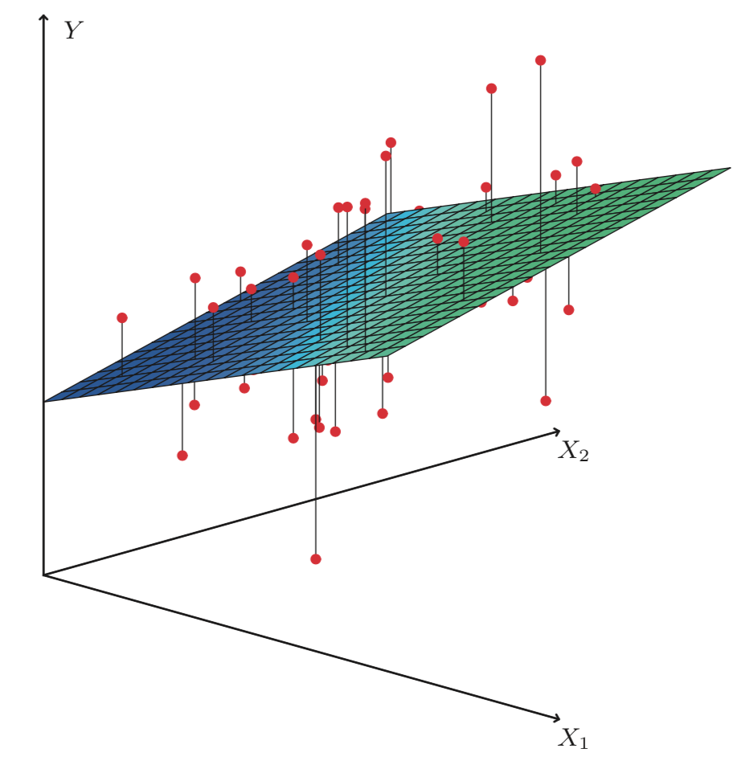
```

---
# Multiple Linear Regression
* The values of `radio` and `TV` better explain the variance;
* Fitting a separate simple linear regression model for each predictor is bad;
* Each of the three regression equations ignores the other two media;


---
# Quick Challenge
* Use the `Prestige` dataset in `cars` dataset;
* Answer the questions: 
  1. Is at least one of the predictors X1 , X2 , . . . , Xp useful in predicting the response?
  2. Do all the predictors help to explain Y, or is only a subset of the predictors useful?
  3. How well does the model fit the data?

---
# Polynomial Regression

* Fitting a higher degree function to the data;
* Differs from the simple linear cases by having multiple degrees for each feature in the dataset;

$$\widehat{y_i} = \theta_0 + \theta_1X_i^1+ \theta_2[X_i^2]^2+...+\theta_n[X_i^n]^n$$

---
# Polynomial Regression in R 

Use the `poly()` function while defining the formula:

```{r, echo=T, eval=F}
lm2 <- lm(pop$uspop ~ poly(pop$year, 2))
```

Alternative:
* Add the terms by hand:

```{r, echo=T, eval=F}
lm3 <- lm(pop$uspop ~ pop$year + I(pop$year^2)))
```

---
class: center, middle, inverse

# Classification Methods


---
class: middle

# Linear Regression Review
## Matrix Notation

$$\widehat{y_i}=\begin{bmatrix} \theta_0 & \theta_1 &\theta_2 & ... & \theta_n\end{bmatrix} \begin{bmatrix} X_i^0 \\ X_i^1 \\ X_i^2 \\ ... \\ X_i^n\end{bmatrix}+\epsilon_i$$
$$\widehat{y_i}=\Theta^TX_i + \epsilon_i$$

---
class: middle 

# Linear Regression Review
## Matrix Notation - For all observations:

$$\begin{bmatrix}\widehat{y_1} \\ \widehat{y_2} \\ ... \\ \widehat{y_m}\end{bmatrix} = \begin{bmatrix}X_1^0 & X_1^1 & ... & X_1^n \\ X_2^0 & X_2^1 & ... & X_2^n \\ ...& ... &... & ...\\X_m^0 & X_m^1 & ... & X_m^n  \end{bmatrix} \begin{bmatrix}\theta_0 \\ \theta_1 \\ ... \\ \theta_n\end{bmatrix} + \begin{bmatrix}\epsilon_1 \\ \epsilon_1 \\ ... \\ \epsilon_m\end{bmatrix}$$
$$\widehat{Y}=X\Theta+\epsilon$$

---
class:middle
#Simple Linear Regression 
A usual way of calculating $\theta_0$ and $\theta_1$ is based on the minimization
of the residual sum of squares (*RSS*):
$$\begin{eqnarray}
RSS &=& \frac{1}{2m} \sum_{i=0}^{m}(\theta_0 + \theta_1X_i^1-y_i)^2
\end{eqnarray}$$

---
class: center, middle, inverse
#Logistic Regression
### Some examples from Andrew Ng Coursera Course
---
class: left
#Logistic Regression
## Problems with the Logistic Regression
* Imagine a case where the output of the regression is a **yes or no question**:
  + Classify tumors according to their size: after a certain size, a tumor is considered malignant;
  + *(Sorry for the handwritten charts)*

```{r, out.width = "500px", fig.align="center", echo=FALSE}
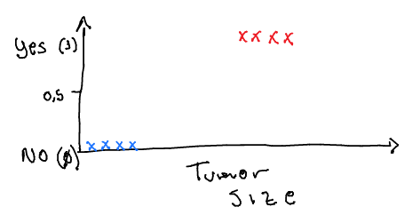
```
---
class: left
# Logistic Regression
## Problems with the Logistic Regression
* This seems almost right
  + Answer $Yes$ if the predicted value is over $0.5$;

```{r, out.width = "550px", fig.align="center", echo=FALSE}
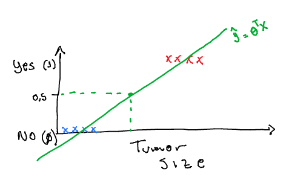
```
---
class: left
# Logistic Regression
## Problems with the Logistic Regression
* ... but if we have outliers in the dataset:
  + The slope starts to be very small
  + Hypothesis can be larger than 1 or smaller than zero

```{r, out.width = "550px", fig.align="center", echo=FALSE}
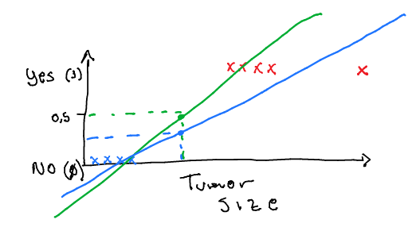
```

???
* By adding a far right point the new regression line (blue) misses a few positive points
* The naming is confusing but it is a classification problem!

---
class: left
# Logistic Regression
## The Logistic Model
* We want $0 \leq \widehat{y_i} \leq 1$;
* The *Sigmoid function*:

```{r, out.width = "450px", fig.align="center", echo=FALSE}
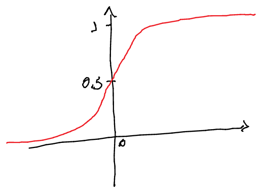
```

???
* Also known as Logistic function
* Assintotes at 1 and 0;


---
class: left
# Logistic Regression
## The Logistic Model
* We want $0 \leq \widehat{y_i} \leq 1$;
* Define a $g()$ function that maps the *Score* of the linear regression to the 0..1 interval:
$$\widehat{y_i} = g(\Theta^T X_i)$$
* Where $g(Z)$ is the **Sigmoid function**:
$$g(Z)=\frac{1}{1-e^{-z}} = \frac{1}{1-e^{-\Theta^TX_i}}$$
* The new $\widehat{y_i}$ between 0 and 1 meand the probability of this example belonging to a class;

---
class: left
# Logistic Regression
## The Logistic Model
* Interpreting the output of the output $\widehat{y_i}$:
  + The probability of the $y_i=1$ on input $X_i$:
$$\widehat{y_i} = p(y=1 | X_i; \Theta)$$
  
  + Probability of $\widehat{y_i} = 1$, on input $X_i$, parameterized by $\Theta$
  + Predict $\widehat{y_i}=1$ if $g(\Theta^TX_i)\geq0.5$ (when $\Theta^TX_i \geq 0$)
  + Predict $\widehat{y_i}=0$ if $g(\Theta^TX_i)<0.5$ (when $\Theta^TX_i < 0$)

???
* The sum of P(y=0)+P(y=1)=1
  + P(y=0) = 1 - P(y=1)
  
---
class: left
# Logistic Regression
## The Decision Boundary
* Boundaries are properties of the output not the data set;

```{r, out.width = "250px", fig.align="center", echo=FALSE}
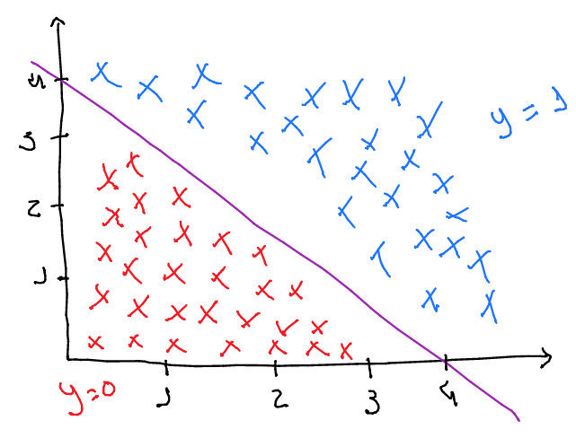
```

  + Decision boundary: $p(\widehat{y_i}=1)=0.5$ $\rightarrow$ $X_1+X_2=4$
  + Predict $\widehat{y_i}=1$ if $-4+X_1+X_2\geq0$ $\rightarrow$ $X_1+X_2\geq4$
  + Predict $\widehat{y_i}=0$ if $-4+X_1+X_2<0$ $\rightarrow$ $X_1+X_2<4$

???
* The value chosen for $\Theta=[-4, 1, 1]$
* Depends on the hypothesis, not the dataset (the full equation, including $\Theta$)

---
class: left
# Logistic Regression
## The Decision Boundary

* What if it is not linear?
* $\widehat{y_i}=g(\theta_0X_i^0+\theta_1X_i^1 + \theta_2X_i^2+\theta_3(X_i^1)^2+\theta_4(X_i^2)^2)$
* With 

$$\Theta = \begin{bmatrix}-1 \\ 0 \\ 0\\ 1\\ 1\end{bmatrix}$$

* Predict $\widehat{y_1}=1$ if $-1+(X_i^1)^2+(X_i^2)^2=0$;

---
class: left
# Logistic Regression
## The Decision Boundary

* The decision boundary: $(X_i^1)^2+(X_i^2)^2=1$
```{r, out.width = "450px", fig.align="center", echo=FALSE}
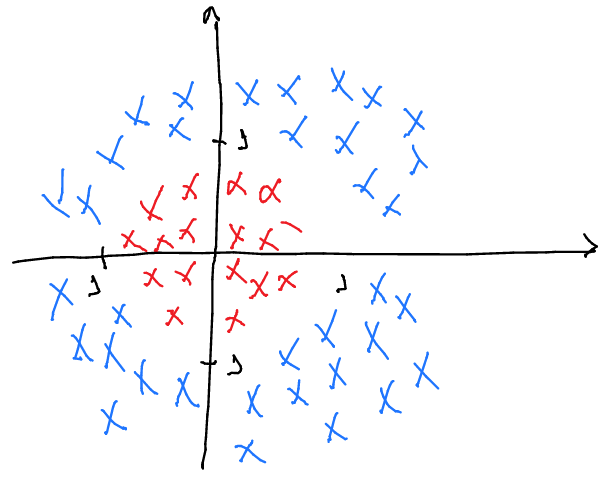
```

---
class: left
# Logistic Regression
## The Decision Boundary

* The decision boundary: $(X_i^1)^2+(X_i^2)^2=1$
```{r, out.width = "450px", fig.align="center", echo=FALSE}
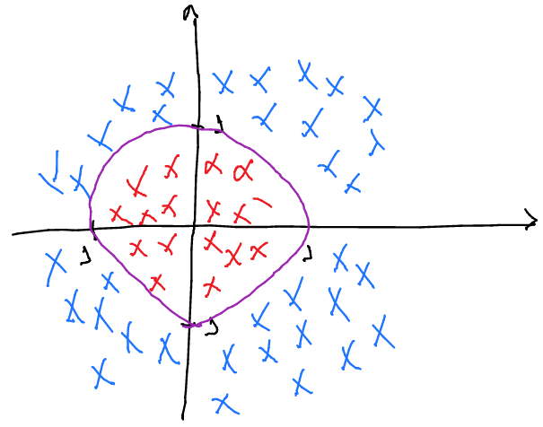
```
???
* Circle of radius 1, centered at the origin
* By addind more complex features, can get more complex Decision Boundaries;
* The decision boundary is defined with $\Theta$

---
class: left
# Logistic Regression
## The Cost function

* The same formulaton:
  + The training set with $m$ observations: ${(y_1,X_1), (y_2, X_2), ..., (y_m, X_m)}$
  + and $X_i$ in $\begin{bmatrix}X_i^0 \\ X_i^1 \\ ... \\X_i^n\end{bmatrix}$, with $X_i^0=1$; 
  + The new $\widehat{y_i}$: 
  $$\widehat{y_i}=\frac{1}{1-e^{-\Theta^TX_i}}$$

---
class: left
# Logistic Regression
## The Cost function

* We need to (heavily) penalize when we predict it wrong, and have $0$ cost when the prediction is correct;
* For the case of $y=1$:
  + if $\widehat{y_i} = 0$ and $y_i=1$, then Cost should be $\infty$;
  + if $\widehat{y_i} = 1$ and $y_i=1$, then Cost should be $0$;
* For the case of $y=0$:
  + if $\widehat{y_i} = 1$ and $y_i=0$, then Cost should be $\infty$;
  + if $\widehat{y_i} = 0$ and $y_i=0$, then Cost should be $0$;
  
$$Cost(\widehat{y_i}, y_i)=\begin{cases} -log(\widehat{y_i})\ \ if\ \ y_i=1 \\ 
-log(1-\widehat{y_i})\ \ if\ \ y_i=0\end{cases}$$

???
* We need to separate in two cases, since we have two classes;
* The cost function -> the cost my algorithm has to pay if it output the wrong $\widehat{y_i}$
* Also, the cost function, i.e., the error would be non convex, thus the gradient maybe wont find the minimum;

---
class: left
# Logistic Regression
## The Cost function

$$Cost(\widehat{y_i}, y_i)=\begin{cases} -log(\widehat{y_i})\ \ if\ \ y_i=1 \\ 
-log(1-\widehat{y_i})\ \ if\ \ y_i=0\end{cases}$$

```{r, out.width = "450px", fig.align="center", echo=FALSE}
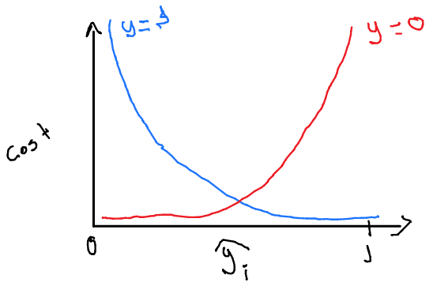
```
???
* Penalize hard when get it wrong;
  + Pay ver large cost when, e.g., y=0 and we predict y=1;

---
class: left
# Logistic Regression
## The Cost function and the Gradient descent:
The error:

$$\epsilon = \frac{1}{m}\sum_{i=0}^{m}Cost(\widehat{y_i}, y_i)$$
The values of $y_i$ is always either $0$ or $1$, thus:

$$Cost(\widehat{y_i}, y_i) = -y_i log(\widehat{y_i}) - (1-y_i) log(1-\widehat{y_i})$$
* If $y_i=0$, then $Cost(\widehat{y_i}, y_i) = -(1-y_i) log(1-\widehat{y_i})$
* If $y_1=1$, then $Cost(\widehat{y_i}, y_i) = -y_i log(\widehat{y_i})$

???
* Compress into one equation the Cost;

---
class: left
# Logistic Regression
## The Cost function and the Gradient descent:
The error:

$$\epsilon = -\frac{1}{m}\sum_{i=0}^{m}y_ilog(\widehat{y_i}) + (1-y_i)log(1-\widehat{y_i})$$
We need to find $\Theta$, in order to get a minimum error $\epsilon$. Thus, the rule to update, during the gradient descent algorithm becomes:
$$\theta_j^{(t+1)} = \theta_j^{(t)}-\alpha\sum_{i=0}^{m}\left(\frac{1}{1-e^{-\Theta^TX_i}}-y_i\right)X_i^j$$
**Identical to Linear Regression**

???
* Can be derived from Maximum Likelihood Estimation;

---
class: left, middle
# In R
* Using the mtcars dataset, discover whether or not a car is automatic by examining its Fuel Efficiency and its Weight;
* Fitting a linear regression model to this data would not work, because we cannot have half a transmission value;
* Logistic regression model;
  - **Logit Function**;

---
class: left, middle
# Challenge:
### Perform the same analysis using the `iris` dataset. Classify try to classify the *setosa* species in terms of Sepal Width and Length;
* Remember to first create a new variable, defining if that observation is from de *setosa* species or not:

```{r, eval=FALSE}
iris.binary <- iris
iris.binary$setosa <- as.numeric(iris[, 5] == "setosa")
```

---
# Decision Trees
* A tree is a structure that has nodes and edges;
* * As simple as “if-then” statements related to data.;

```{r eval=T, fig.height=3, message=FALSE, warning=FALSE, paged.print=FALSE}
library(party)
tree <- ctree(mpg ~ ., data = mtcars)
plot(tree)
```
???
We are plotting engine fuel efficiency (mpg), but we’re using all features in the dataset to build the model instead of just one; hence, the mpg ~ . call in the ctree() function. 

The output is a distribution (in the form of a box-and-whisker plot) of the fuel efficency as a function of the major features that influence it. 

The ctree function calls on certain methods to figure these out; this way, you don’t have a bunch of branches in the tree that don’t amount to anything other than to clog up the view. 

In this case, the features that are most important to mpg are disp (the engine displacement) and wt (the car’s weight). You read this chart from top to bottom.

---
# Decision Trees

* A collection of decision nodes connected by branches, extending from the root node and terminating at the leaf nodes. 
* Attributes are tested at each decision node
* each possible outcome results in a branch. 
* Decision trees are mostly used for classification problems, where the outcome is categorical;
* widely used in the medical and finance domains;
* One the most important tools for physicists;

---
# Decision Trees Example

### Bike race outcome prediction according to the weather conditions

```{r, out.width = "350px", fig.align="center", echo=FALSE}
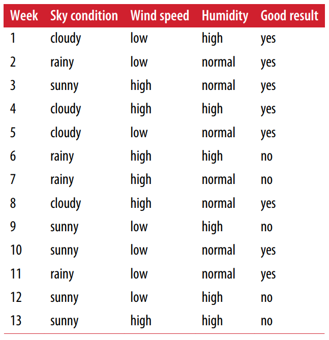
```

???
Let’s begin by looking at an **example of a set of data that describes my bike races** this year. We could have a **variety of parameters just related to the weather**. If I had a **robust enough sample of data** and I had a bike race coming up where **I knew the forecast to a reasonable degree**, should I expect a good or bad result to my bike race?

---
# Decision Trees Example
### Forecast conditions for the Race day:
* Sky Condition: rainy
* Wind speed: low
* Humidity: high

???
 if this data were in a spreadsheet, would be to filter our data on
those exact conditions and see what the results look like

---
# Decision Trees Example

* Start by subseting the data by certain criteria;
* then build a tree so that when we have new data, it follows the branches of the tree to a result.
* On the example: first split being on the Sky Condition variable.

--
```{r, out.width = "650px", fig.align="center", echo=FALSE}
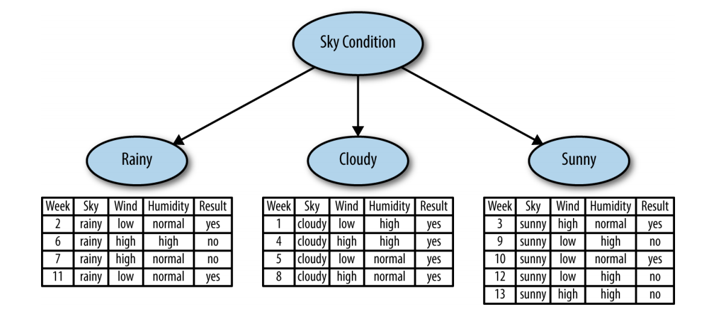
```

???
shows three leaves in the tree: Sky Condition = rainy, Sky Condition =
cloudy, and Sky Condition = sunny.

The response you want to model is whether I’m going to have a good
result in my race. A decision tree looks at these subsets and examines whether the
Result variable contains all of one particular class

For cloudy races, I have a good result being yes for each one. This indicates that the subset is **pure** and that you don’t need to split it any further. However, the sunny and rainy subsets have a mix of yes and no results. You’ll want to split these further to get a subset with higher purity.

Purity is defined as how many positive or negative examples you have that you’re try‐
ing to model for (in this case, Result) out of the total values in the table. You want to
continue to split the tree until you have as many pure leaves as possible.


---
# Decision Trees Example

* Splitting up the rainy and sunny subsets further: by wind and humidity;
* Five terminal points to the tree;
--
```{r, out.width = "650px", fig.align="center", echo=FALSE}
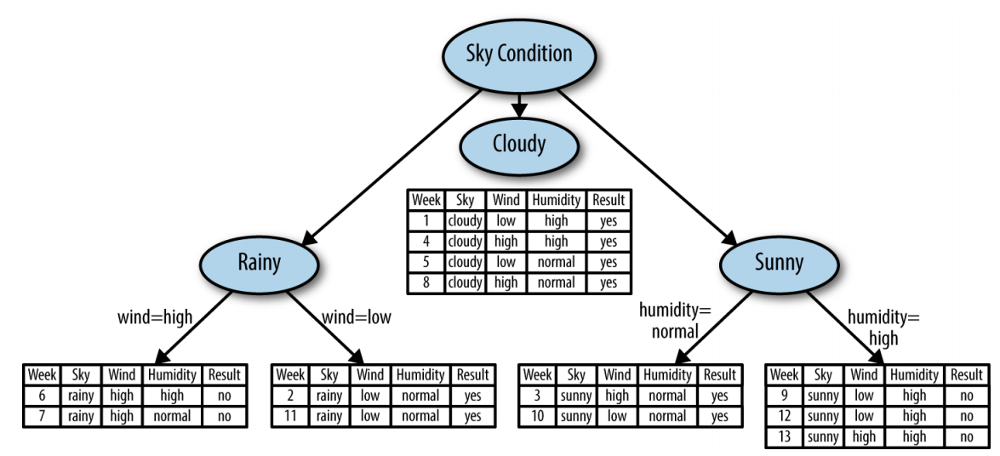
```
???
read  like an “if-then” statement, 
* starting at the top. 

what you want to predict: want to know if I’m going to have a good
race result if it’s **rainy**, with **low wind speed**, and **high humidity**. 

* Begin at the top of the tree
* Move along the path of Sky Condition = rain, 
* split on the wind speed being low. 
* That brings you into a bucket that has all of its data having a good result status of yes. 

---
class: left, middle
# Challenge: 
### Use the Iris dataset to perform an analysis of their species using Decision Trees. 

---
# Classification: types of errors
## Basic Terms:

* True Positive: correctly identified
* True Negative: correctly rejected
* False Positive: incorrectly identified
* False Negative: incorrectly rejected

### Medical Testing Example:
* True Positive: Sick people correctly identified as sick
* True Negative: Healthy people correctly identified as healthy
* False Positive: Healthy people incorrectly identified as sick
* False Negative: Sick people incorrectly identified as healthy

???
If it was inside the medical domain, the positive would mean: identify, and the negative would mean reject;

---
# Classification: types of errors
## Confusion Matrix:

```{r, out.width = "450px", fig.align="center", echo=FALSE}
knitr::include_graphics("images/confusion_matrix.png")
```

---
```{r, include=FALSE}
library(e1071)
library(caret)
```

```{r, eval=TRUE, echo=TRUE}
mtcars$am <- as.factor(mtcars$am) 
cars.log_reg <- glm(am ~ mpg, data=mtcars, family = "binomial")
X <- as.data.frame(mtcars$mpg)
names(X) <- "mpg"
predict_prob <- predict(cars.log_reg, X, type="response")
predicted_values <- rep(0, length(predict_prob))
predicted_values[predict_prob >= 0.5] <- 1
predicted_values <- as.factor(predicted_values)
confusionMatrix(mtcars$am, predicted_values)

```


---
class: center, middle

# Thanks!

Slides created via the R package [**xaringan**](https://github.com/yihui/xaringan).

